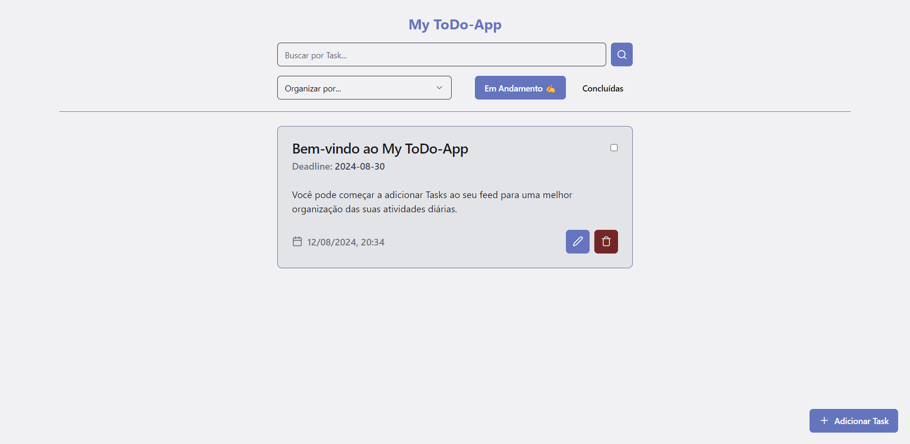

<h1 align="center">My-ToDo-App</h1>

<p align="center">
  
</p>

<br>

## 💻 Projeto

My-Todo-App é uma aplicação de gerenciamento de tarefas que permite ao usuário adicionar, atualizar, e remover tarefas, além de filtrá-las por estado de conclusão e data limite. O projeto foi desenvolvido com foco em boas práticas de usabilidade e design responsivo.

## 🧪 Tecnologias

- [ReactJS](https://react.dev/): Biblioteca JavaScript para a construção de interfaces de usuário.
- [TypeScript](https://www.typescriptlang.org/): Superset do JavaScript que adiciona tipagem estática ao código.
- [Vite](https://vitejs.dev/): Ferramenta de desenvolvimento para frontend que proporciona um build rápido e otimizado.
- [JSON Server](https://github.com/typicode/json-server): Ferramenta para criação de uma API REST falsa rapidamente para desenvolvimento frontend.
- [Axios](https://axios-http.com/ptbr/): Cliente HTTP baseado em promessas para o navegador e node.js.

## 🖌️ Bibliotecas UI

- [LucideIcons](https://lucide.dev/icons/): Biblioteca de ícones de código aberto para aplicações modernas.
- [Tailwind](https://tailwindcss.com/): Framework de CSS para design rápido e customizável.
- [ShadCn](https://ui.shadcn.com/): Biblioteca de componentes UI para um desenvolvimento rápido.

## 🛠️ Funcionalidades

- Adicionar, editar e remover tarefas.
- Filtrar tarefas por estado (em andamento ou concluídas) e por data limite.
- Buscar tarefas por título.
- Interface responsiva e intuitiva.

## 📑 Como Inicializar a Aplicação Localmente

Siga os passos abaixo para configurar e rodar o projeto em sua máquina local:

### Pré-requisitos

- Node.js (versão 14 ou superior)
- npm (gerenciador de pacotes do Node.js)

### Passo a Passo

1. **Clone o repositório:**

   Abra o terminal e execute o seguinte comando para clonar o repositório para o seu computador:

   ```bash
   git clone https://github.com/AntDavi/todo-app
   ```
2. **Execulte o projeto:**

   ```bash
   # Entrar no diretorio
   $ cd tod-app

   # Intalação das dependencias
   $ npm install

   # Para execultar o projeto
   $ npm run dev

   # Para execultar o servidor
   $ npm run start:server
   ```

## 📝 Licensa

Este projeto está licenciado sob a Licença MIT. Veja o arquivo [LICENSE](LICENSE) para obter mais detalhes.

---

<p align='center'>Criado por Anthony Davi 🙃</p>
